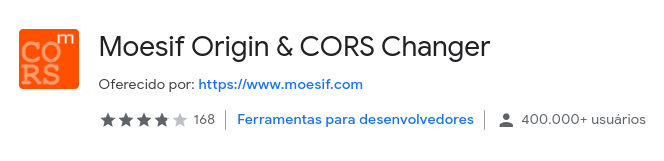

# Uma requisição de uma API de Criptomoeda com JavaScript

### JavaScrip, o GET com a ```API FETCH``` que é nativa do JS e consulta a API ```coinmarketcap.com```...tudo em um só arquivo HTML de forma ```organizada``` e não quebrando as boas práticas. 

## Fontes de apoio ao desenvolvimento:
Projeto Web utilizando a API Coin Market Cap <br>
[Portal do desenvolvedor - coinmarketcap](https://pro.coinmarketcap.com/account) <br>
[Documetação de autenticação](https://coinmarketcap.com/api/documentation/v1/#section/Authentication) <br>
[Documentação API](https://coinmarketcap.com/api/documentation/v1/#) <br>
[Usando Fetch](https://developer.mozilla.org/pt-BR/docs/Web/API/Fetch_API/Using_Fetch)

# Necessário extensão no Chrome:
<p align="left"></p>

[Moesif Origin & CORS Changer](https://chrome.google.com/webstore/detail/moesif-origin-cors-change/digfbfaphojjndkpccljibejjbppifbc?hl=pt-BR)


## 🚀 Pra cima...AVANTE! 🚀
